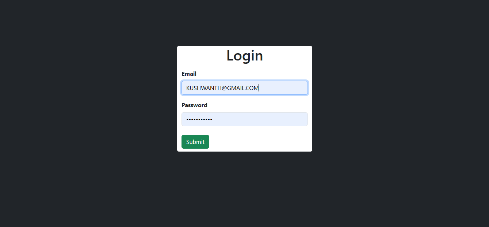
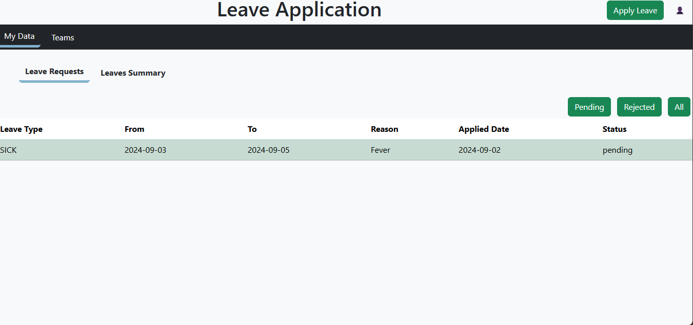
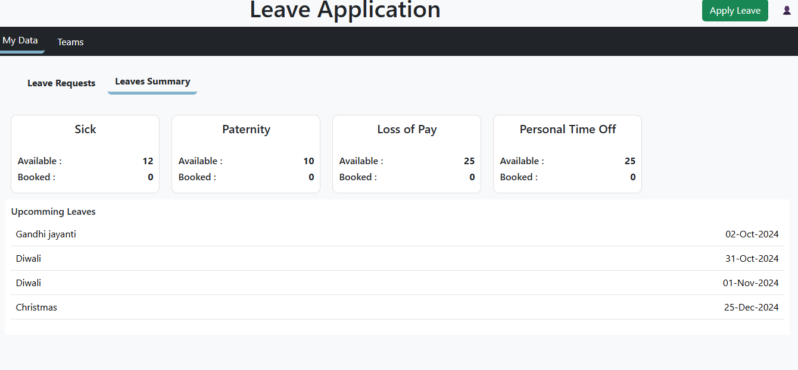
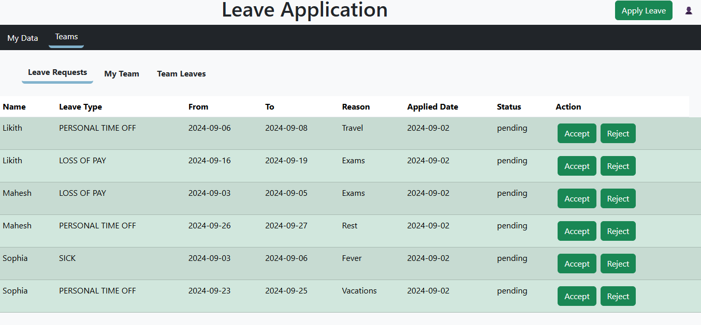
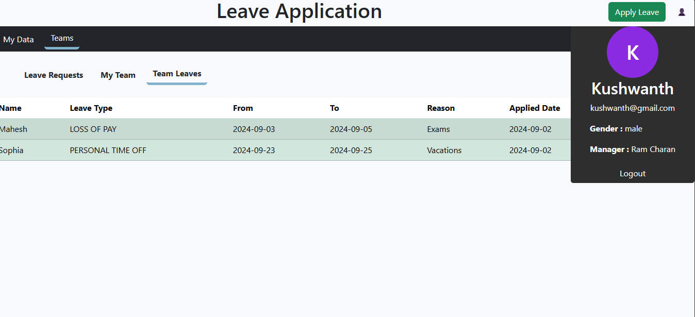
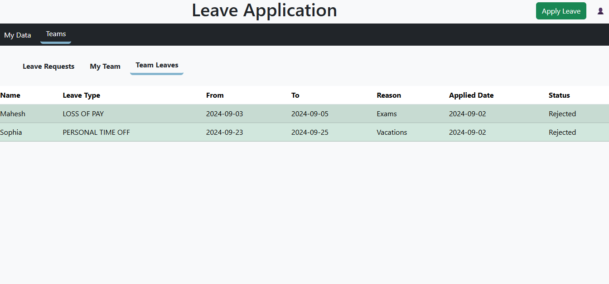
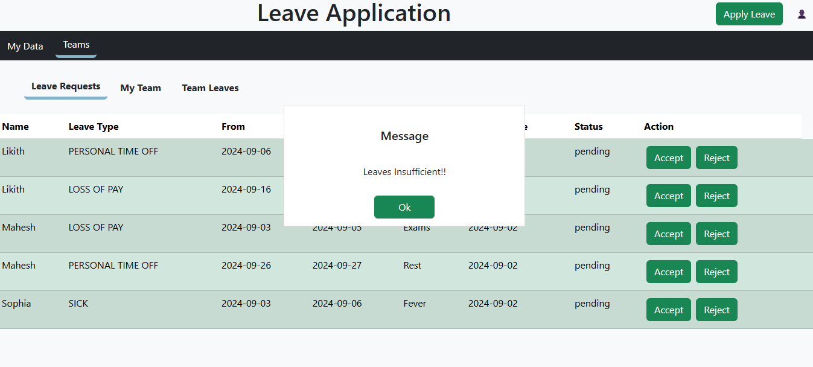

# Leave Management System

## Overview

The Leave Management System is designed to streamline the process of managing employee leave requests. It includes functionalities for users to view their leave status, manage leave requests, and for managers to approve or reject leaves. Some features are still under development. Below is a detailed explanation of each feature with corresponding screenshots where available.

## Features

### 1. Login Page
- **Description**: The login page allows users to authenticate and access the system.
- **Screenshot**: 

### 2. Dashboard
- **Description**: After logging in, users are directed to the dashboard. This page provides an overview of leave requests and other relevant information.
- **Screenshot**: 

### 3. Leave Requests
- **Description**: Clicking on the "Leave Requests" tab shows a list of leaves that have been applied, rejected, or approved. Users can filter these requests based on their status (pending, all, rejected).
- **Screenshot**: 

### 4. Leave Summary
- **Description**: Clicking on "Leave Summary" displays a summary of leaves taken by employees. This view provides an overview of leave usage.
- **Screenshot**: 

### 5. Team Leave Requests
- **Description**: Under the "Teams" tab, clicking "Leave Request" fetches requests that need approval from the manager.
- **Screenshot**: 

### 6. My Team
- **Description**: Clicking the "My Team" button retrieves a list of team members.
- **Screenshot**: 

### 7. User Profile
- **Description**: Clicking the profile icon displays user information, such as name and role.
- **Screenshot**: 

### 8. Team Leaves
- **Description**: Clicking on "Team Leaves" fetches the approved or rejected leaves by the manager for review.
- **Screenshot**: 

### 9. Approving Leave
- **Description**: When clicking the "Approve" button, user information and leave details are displayed. To confirm the approval, the user must press the confirm button.
- **Screenshot**: 

### 10. Insufficient Leaves
- **Description**: If there are insufficient leaves available when trying to approve a request, a message is displayed indicating the issue.
- **Screenshot**: 

## Pending Functionalities

The following features are still under development:

- **Date Validation**: Implement date validation to ensure leave requests do not overlap with weekends or holidays.
- **Email Notifications**: Set up email notifications to inform users about the status of their leave requests and updates.
- **Team Leaves Count Summary**: Develop a summary view of the total leave count for the team, including approved, pending, and rejected leaves.
- **Availability Check**: Incorporate an availability check during the leave approval process to ensure leaves can be accommodated.

